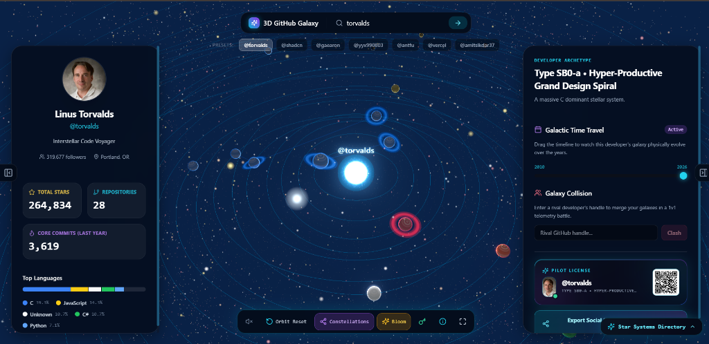
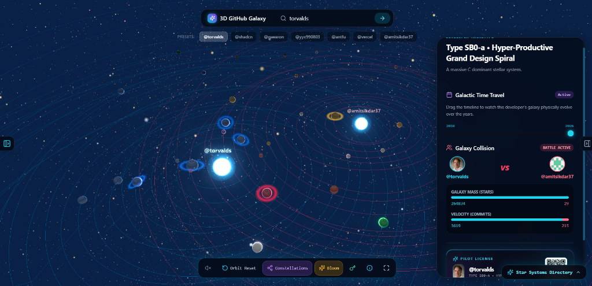

<div align="center">

# 🌌 3D GitHub Galaxy

### *Transform Any GitHub Profile into an Interactive 3D Solar & Galactic Universe*

[](https://am1t-builds-8jyb-2khnqu5m0-amitsikdar37s-projects.vercel.app/)
[](https://nextjs.org/)
[](https://threejs.org/)
[](https://www.typescriptlang.org/)
[](https://tailwindcss.com/)
[](LICENSE)

<br />

**[🚀 Explore the Live Galaxy](https://am1t-builds-8jyb-2khnqu5m0-amitsikdar37s-projects.vercel.app/)** • **[✨ View Features](#-features)** • **[🔬 Physics & Math](#-astronomical-physics--algorithms)** • **[🛠️ Tech Stack](#️-tech-stack)** • **[⚡ Quickstart](#-getting-started)**

<br />

---

### 🌟 Single Developer Galaxy Mode
*Explore repositories as orbiting celestial bodies with realistic Keplerian orbital mechanics, dynamic atmosphere shaders, and customizable telemetry HUD.*



---

### 💥 Galaxy Collision Battle Mode (1v1 Telemetry Duel)
*Spawn two rival developer galaxies in a shared gravitational field and compare Galaxy Mass (Stars) against Velocity (Commits).*



---

</div>

<br />

## 📖 Overview

**3D GitHub Galaxy** is an immersive WebGL & Three.js universe visualization engine that turns your GitHub developer journey into an interactive 3D planetary and stellar system. 

Every developer is represented by a central glowing star or supermassive core whose luminosity and radius scale with total lifetime contributions. Their repositories become individual planets orbiting in mathematically calculated elliptical tracks governed by Keplerian orbital mechanics. 

Planetary textures, atmospheric glows, rings, and dust belts dynamically generate according to programming languages, stargazers, disk usage, and recency of code commits.

---

## ✨ Features

### 🪐 1. Real-Time Keplerian Orbit & Planetary Physics
- **Elliptical Orbital Paths**: Every repository planet travels along its own unique elliptical orbit with custom semi-major axis ($a$), semi-minor axis ($b$), eccentricity ($e$), inclination tilt, and periapsis orientation.
- **Collision Prevention**: Non-intersecting orbital track spacing prevents planetary overlapping.
- **Procedural 2K/4K Planet Textures**: Canvas-synthesized textures featuring gas-giant cloud bands, surface craters, and micro-turbulence.
- **Custom Fresnel Glow Shaders**: Custom GLSL vertex and fragment shaders render atmospheric rim lighting for each planetary body.
- **Particle Belts & Planetary Rings**: Top-tier repositories receive planetary ring discs and revolving asteroid dust belts reflecting active development velocity.

### 💥 2. Galaxy Collision (1v1 Telemetry Battle)
- Merge two separate developer galaxies into a single orbital simulation.
- Dual stellar cores with interlaced gravitational orbits.
- Real-time **Galaxy Mass** (Stargazers) and **Velocity** (Commits) comparison meters.

### ⏳ 3. Galactic Time Travel (Chrono Timeline)
- Interactive time-travel slider allowing you to step back through time from repository genesis to present day.
- Watch planetary systems form, expand, and accrete code mass over the years.

### 🧬 4. Developer Archetype Classification
- Dynamic classification algorithm categorizing developer systems based on productivity and architecture:
  - `Type SB0-a • Hyper-Productive Grand Design Spiral`
  - `Type SA-b • High-Luminosity Multi-Arm Stellar Galaxy`
  - `Type S-c • Active Intermediate Starburst Galaxy`
  - `Type dS-m • Multi-Node Dwarf Spiral Galaxy`
  - `Type Irr-I • Emerging Nebula Cluster`

### 🎵 5. Procedural Web Audio Ambient Synthesizer
- Built-in sound engine powered by the **Web Audio API**.
- Generates procedural cosmic drone frequencies and harmonic hums modulated by galactic mass and planetary orbital velocities.

### 🎫 6. Pilot License & Social Story Export
- Generate a sci-fi **Pilot Flight Pass** (1080x1920) with telemetry badges, star stats, and scannable profile QR code.
- One-click image export using `html2canvas` for sharing on social media.

### 🔍 7. Constellation System & Star Details Inspection
- **Constellation Lines**: Interconnecting lines dynamically map related repositories and language ecosystems.
- **Star Inspector Sidebar**: Deep-dive inspection modal with metrics, language distribution, direct GitHub URLs, and previous/next planetary orbit traversal.
- **Quick Directory Tour Matrix**: Bottom-right constellation drawer for rapid jump navigation to any star system.

### ⚡ 8. GraphQL API & Offline Procedural Fallback
- Authenticated GitHub GraphQL v4 API integration with client-side custom Personal Access Token (PAT) support to bypass rate limits.
- Seamless fallback to public REST API and built-in procedural galaxy generation for 100% uptime and offline demoing.

---

## 🔬 Astronomical Physics & Algorithms

### 1. Keplerian Elliptical Orbit
Each planet's 3D position $(x, y, z)$ at true anomaly $\theta$ is calculated using:

$$\begin{aligned}
r(\theta) &= \frac{a(1 - e^2)}{1 + e \cos(\theta)} \\
x_{\text{orbit}} &= a \cos(\theta) \\
z_{\text{orbit}} &= b \sin(\theta)
\end{aligned}$$

With rotation by periapsis angle $\omega$ and inclination tilt $i$:

$$\begin{aligned}
x &= x_{\text{orbit}} \cos(\omega) - z_{\text{orbit}} \sin(\omega) \\
y &= \left(x_{\text{orbit}} \sin(\omega) + z_{\text{orbit}} \cos(\omega)\right) \sin(i) \\
z &= \left(x_{\text{orbit}} \sin(\omega) + z_{\text{orbit}} \cos(\omega)\right) \cos(i)
\end{aligned}$$

### 2. Kepler's Third Law (Orbital Speed)
Planetary orbital velocity $v$ scales inversely with the square root of the semi-major axis $a$, causing inner planets to orbit faster than outer gas giants:

$$v_{\text{orbit}} \propto \frac{1}{\sqrt{a}}$$

### 3. Planetary Radius Computation
Planetary radius $R$ is computed via multi-variable logarithmic scaling to prevent large star counts from dwarfing smaller repositories:

$$R = R_{\text{base}} + 1.2 \cdot \left( \frac{\log_{10}(\text{Stars} + 1)}{\log_{10}(\text{MaxStars} + 1)} \right) + 0.4 \cdot \min\left(\frac{\log_{10}(\text{DiskUsage} + 1)}{5}, 1.0\right) + \text{PrestigeBonus}$$

---

## 🛠️ Tech Stack

| Domain | Technology |
| :--- | :--- |
| **Framework** | [Next.js 14](https://nextjs.org/) (App Router, Server Components & Route Handlers) |
| **Language** | [TypeScript](https://www.typescriptlang.org/) |
| **3D Rendering** | [Three.js](https://threejs.org/) & [Three-Stdlib](https://github.com/pmndrs/three-stdlib) |
| **Post-Processing** | UnrealBloomPass, EffectComposer, FXAA, ToneMapping |
| **Styling** | [Tailwind CSS](https://tailwindcss.com/) & Custom Sci-Fi Glassmorphism Design System |
| **Animations** | [GSAP (GreenSock)](https://greensock.com/gsap/) |
| **Audio** | Web Audio API (Generative Dual-Oscillator Ambient Synthesizer) |
| **Icons** | [Lucide React](https://lucide.dev/) |
| **Export Engine** | [html2canvas](https://html2canvas.hertzen.com/) |
| **APIs** | GitHub GraphQL API v4 & GitHub REST API v3 |
| **Deployment** | [Vercel](https://vercel.com/) |

---

## 🚀 Getting Started

### Prerequisites
- [Node.js](https://nodejs.org/) (v18.17.0 or higher recommended)
- [npm](https://www.npmjs.com/) or [yarn](https://yarnpkg.com/) / [pnpm](https://pnpm.io/)

### 1. Clone the Repository
```bash
git clone https://github.com/amitsikdar37/3d-github-galaxy.git
cd 3d-github-galaxy
```

### 2. Install Dependencies
```bash
npm install
```

### 3. Set Up Environment Variables (Optional)
To increase GitHub API rate limits from 60 to 5,000 requests/hour, create a `.env.local` file in the root directory:

```env
GITHUB_TOKEN=your_personal_access_token_here
```

*(Note: Users can also input their own token directly through the in-app HUD key modal without modifying `.env.local`)*

### 4. Run the Development Server
```bash
npm run dev
```

Open [http://localhost:3000](http://localhost:3000) in your browser to enter the galaxy.

### 5. Build for Production
```bash
npm run build
npm run start
```

---

## 🌐 Live Demo & Deployment

The application is deployed on Vercel and accessible globally:

👉 **[https://am1t-builds-8jyb-2khnqu5m0-amitsikdar37s-projects.vercel.app/](https://am1t-builds-8jyb-2khnqu5m0-amitsikdar37s-projects.vercel.app/)**

---

## 🎮 Navigation & Keyboard Controls

| Control | Action |
| :--- | :--- |
| **Left Click + Drag** | Rotate galaxy camera orbit in 3D space |
| **Right Click + Drag** | Pan camera across the galactic plane |
| **Scroll Wheel / Pinch** | Zoom in / Zoom out |
| **Click on Planet / Star** | Focus and zoom camera directly onto planetary system |
| **Preset Selector** | Quick warp to featured profiles (`@torvalds`, `@shadcn`, `@gaearon`, etc.) |
| **Orbit Reset** | Re-center camera to the Supermassive Galactic Core |
| **Constellations Toggle** | Toggle language-linked constellation paths on/off |
| **Bloom Toggle** | Toggle UnrealBloom glowing star shaders |
| **Audio Synthesizer** | Mute / unmute procedurally synthesized space drones |
| **Panels Toggle** | Collapse or expand HUD telemetry sidebars |

---

## 📂 Project Architecture

```
3D-Github-Galaxy/
├── assets/                       # High-res README screenshots
│   ├── galaxy-overview.png
│   └── galaxy-collision.png
├── public/                       # Static public assets
│   └── screenshots/
├── src/
│   ├── app/
│   │   ├── api/
│   │   │   └── galaxy/route.ts   # GitHub GraphQL / REST telemetry endpoint
│   │   ├── globals.css           # Sci-Fi space theme styling & animations
│   │   ├── layout.tsx            # Root layout & font configurations
│   │   └── page.tsx              # Main Galaxy Experience Controller
│   ├── components/
│   │   ├── ConstellationTour.tsx # Star directory quick drawer
│   │   ├── CustomTokenModal.tsx  # GitHub PAT manager modal
│   │   ├── GalaxyCanvas.tsx      # Three.js Canvas & WebGL viewport mount
│   │   ├── GalaxyControls.tsx    # Bottom HUD controls & action toolbar
│   │   ├── GalaxyHUD.tsx         # Telemetry panels, search & time travel
│   │   ├── InfoGuideModal.tsx    # Pilot instructions & physics guide
│   │   ├── StarDetailsModal.tsx  # Planet inspection details drawer
│   │   └── StarTooltip.tsx       # 2D projected hover card
│   ├── lib/
│   │   ├── audio-synthesizer.ts  # Web Audio procedural space synthesizer
│   │   ├── galaxy-math.ts        # Kepler orbital math & planetary physics
│   │   ├── github-service.ts     # GraphQL queries & REST fallback engine
│   │   ├── language-colors.ts    # Programming language color palette
│   │   └── types.ts              # TypeScript type definitions
│   └── three/
│       ├── CentralCore.ts        # Supermassive central sun & corona glow
│       ├── ConstellationLines.ts # Inter-stellar constellation mesh
│       ├── CosmicDust.ts         # Volumetric space particles
│       ├── PostProcessing.ts     # Bloom & FXAA post-processing passes
│       ├── StarSystem.ts         # Planet geometry, rings, and textures
│       └── utils.ts              # Texture generators & canvas utilities
├── next.config.mjs
├── tailwind.config.ts
├── tsconfig.json
└── package.json
```

---

## 🤝 Contributing

Contributions, suggestions, and feature requests are welcome!

1. Fork the Project
2. Create your Feature Branch (`git checkout -b feature/CosmicFeature`)
3. Commit your Changes (`git commit -m 'Add some CosmicFeature'`)
4. Push to the Branch (`git push origin feature/CosmicFeature`)
5. Open a Pull Request

---

## 📜 License

Distributed under the **MIT License**. See [`LICENSE`](LICENSE) for more information.

---

<div align="center">

Crafted with 💙 and 🌌 by **[Amit Sikdar](https://github.com/amitsikdar37)**

[](https://github.com/amitsikdar37)

</div>
